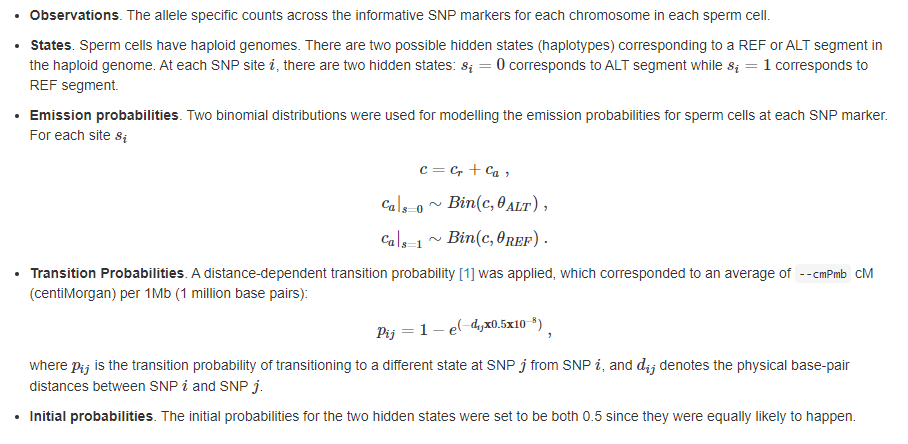

## sgcocaller: Calling crossovers from single-gamete DNA sequencing reads

Two main modules are available in `sgcocaller`, phasing and crossover calling.
`sgcocaller phase` generates donor haplotype from single-gamete DNA sequencing data.
 `sgcocaller xo` and `sgcocaller sxo` both call crossovers in each single 
 gamete using a Hidden Markov Model.

`sgcocaller` processes DNA reads from each single gamete in the aligned and 
sorted BAM file for inferring the haplotypes of single gamete genomes that can 
later be used for identifying crossovers through finding haplotype shifts (see [comapr](https://github.com/ruqianl/comapr)).

It takes the large bam file which contains all aligned DNA reads from gamete cells and 
summarizes allele counts for the provided informative SNP markers. While counting
the alleles, the Viterbi algorithm is executed for finding the haplotype 
sequence for the list of SNP markers. 

### Publication

[BioRxiv paper](https://www.biorxiv.org/content/10.1101/2022.02.10.479822v1)


## Hidden Markov Model configuration

        
## Inputs

- Bam, sorted and index bam file which contains DNA reads of single gamete cells 
with `CB` tag, eg. from single-cell preprocessing pipeline (CellRanger, STARSolo, etc)
- VCF, variant call file that contains the list of informative SNPs (phased or unphased SNPs)
- barcodeFile, the list of cell barcodes of the gametes

## Main outputs

* *.mtx
  * sparse matrix with columns corresponding to the list of gamete cell barcodes and rows corresponding to the list of SNP positions in VCF file
  * {sample}_chr1_altCount.mtx, a sparse mtx with entries representing alternative allele counts 
  * {sample}_chr1_totalCount.mtx, a sparse mtx with entries representing total allele counts 
  * {sample}_chr1_vi.mtx, a sparse mtx with entries representing inferred viterbi state (haplotype state) 
* {sample}_chr1_snpAnnot.txt, the SNP positions and allele 
* {sample}_chr1_viSegInfo.txt, statistics of the Viterbi state segments in text file format.  It contains consecutive 
  viterbi states for each chromosome with statistics including, starting SNP position, ending SNP position, the number of SNPs
  supporting the segment, the log likelihood ratio of the viterbi segment and the inferred hidden state.


## Usage

```

Usage:
      sgcocaller phase [options] <BAM> <VCF> <barcodeFile> <out_prefix>
      sgcocaller swphase [options] <gtMtxFile> <phasedSnpAnnotFile> <referenceVCF> <out_prefix>
      sgcocaller sxo [options] <SNPPhaseFile> <phaseOutputPrefix> <barcodeFile> <out_prefix>
      sgcocaller xo [options] <BAM> <VCF> <barcodeFile> <out_prefix>

Arguments:

  <BAM> the read alignment file with records of single-cell DNA reads

  <VCF> the variant call file with records of SNPs with hetSNPs phased in the form of REF/ALT or the GT field

  <barcodeFile> the text file containing the list of cell barcodes

  <out_prefix>  the prefix of output files

Options:
  -t --threads <threads>  number of BAM decompression threads [default: 4]
  --barcodeTag <barcodeTag>  the cell barcode tag in BAM [default: CB]
  --minMAPQ <mapq>  Minimum MAPQ for read filtering [default: 20]
  --baseq <baseq>  base quality threshold for a base to be used for counting [default: 13]
  --chrom <chrom>  the selected chromsome (whole genome if not supplied,separate by comma if multiple chroms)
  --minDP <minDP>  the minimum DP for a SNP to be included in the output file [default: 1]
  --maxDP <maxDP>  the maximum DP for a SNP to be included in the output file [default: 5]
  --maxTotalDP <maxTotalDP>  the maximum DP across all barcodes for a SNP to be included in the output file [default: 25]
  --minTotalDP <minTotalDP>  the minimum DP across all barcodes for a SNP to be included in the output file [default: 10]
  --minSNPdepth <minSNPdepth>  the minimum depth of cell coverage for a SNP to be includes in generated genotype matrix file [default: 1]
  --thetaREF <thetaREF>  the theta for the binomial distribution conditioning on hidden state being REF [default: 0.1]
  --thetaALT <thetaALT>  the theta for the binomial distribution conditioning on hidden state being ALT [default: 0.9]
  --cmPmb <cmPmb>  the average centiMorgan distances per megabases default 0.1 cm per Mb [default: 0.1]
  --phased  the input VCF for calling crossovers contains the phased GT of heterozygous SNPs
  --outvcf  generate the output in vcf format (phase)
  --templateCell <templateCell>  the cell's genotype to be used a template cell, as the cell's index (0-starting) in the barcode file, default as not supplied [default: -1]
  --maxDissim <maxDissim>  the maximum dissimilarity for a pair of cell to be selected as potential template cells due to not having crossovers in either cell [default: 0.0099]
  --maxExpand <maxExpand>  the maximum number of iterations to look for locally coexisting positions for inferring missing SNPs in template haplotype sequence [default: 1000]
  --posteriorProbMin <posteriorProbMin>  the min posterior probability when inferring missing SNPs [default: 0.99]
  --lookBeyondSnps <lookBeyondSnps>  the number of local SNPs to use when finding switch positions [default: 25]
  --minSwitchScore <minSwitchScore>  the minimum switch score for a site to be identified as having a switch error in the inferred haplotype and corrected [default: 50.0]
  --minPositiveSwitchScores <minPositiveSwitchScores>  the min number of continuing SNPs with positive switch scores to do switch error correction [default: 8]
  -h --help  show help


  Examples
      ./sgcocaller phase --threads 4 --barcodeTag CB --chrom 'chr1' --minDP 2 possorted_bam hetSNPs.vcf.gz barcodeFile.txt outdir/path/withPrefix_ 
      ./sgcocaller xo --threads 4 possorted_bam.bam dbSNP-hetSNPs.vcf.gz barcodeFile.tsv ./percell/ccsnp
      ./sgcocaller sxo phaseOutputPrefix barcodeFile.tsv ./percell/ccsnp

```
### Run for single-cell DNA sequenced gametes with donor haplotype known 

In cases where the haplotype of the donors is known (i.e the list of hetSNPs has been phased, or the donor is an F1 hybrid sample), `sgcocaller xo` can be called directly:

For F1 hybrid donor:

```
      ./sgcocaller xo --threads 4 possorted_bam.bam --cmPmb 1e-3  dbSNP-hetSNPs.vcf.gz barcodeFile.tsv ./percell/ccsnp

```

`cmPmb` controls the transition probabilites in the HMM model and it is dependent on the physical distances of the two markers[1]. It is recommended to set a smaller transition
probability for sparse and low coverage dataset.

dbSNP-hetSNPs.vcf.gz contains the list of hetSNPs, and the list of REF alleles (or the list of ALT alleles) is the haplotype of the F1 hybrid donor.

For phased hetSNPs provided in VCF file, the GT field is used to extract the haplotype of the donor and `sgcocaller xo` can be called directly:

```
      ./sgcocaller xo --threads 4 --cmPmb 1e-3  --phased possorted_bam.bam phased-hetSNPs.vcf.gz barcodeFile.tsv ./percell/ccsnp

```
### Run for single-cell DNA sequenced gametes with donor haplotype unknown 

When hetSNPs' phase or haplotype of the donor is unknown, `sgcocaller phase` module can produce the donor haplotype using the single-gamate DNA sequencing dataset.

```
      ./sgcocaller phase --threads 4 --barcodeTag CB --chrom 'chr1' --minDP 2 possorted_bam hetSNPs.vcf.gz barcodeFile.txt outdir/path/withPrefix_ 
```
when specifying `--outvcf` with above command, `./sgcocaller phase` will generate the phased hetSNPs in VCF format.

`./sgcocaller swphase` is an additional module for identifying potential switch errors in the genrated haplotype from `./sgcocaller phase`. The provided utility R code
can be used for plotting diagnostic plots which reveal whether `./sgcocaller swphase` should be run to scrutinize switching errors.

```
       ./sgcocaller swphase --chrom "chr1" gtMtxfile.mtx chr1_phased_snpAnnot.txt unphasedHetSNPs.vcf.gz output/dirpath/phaseCorrected/chr1_
```

Since the `./sgcocaller phase` has done the heavy lifting of parsing through the BAM and VCF file that generated the allele counts file and genotype matrix file, the crossover
calling step in this use-case can be done through calling `sgcocaller sxo` that takes these outputs directly:

```
        ./sgcocaller sxo --thetaREF 0.1 --thetaALT 0.9 --cmPmb 1e-3 --chrom "chr1" sgphase_snp_annot.txt output/sgcocaller/phaseOneStep/apricot_ 
```

### Run for a Bam of a single cell (bulk sample)

For cases where the DNA reads do not have a cell barocode tag (CB) ie. Bam file for one gamete or a bulk sample, `sgcocaller` can
still be applied by adding one simple step:

1, Prepare a bulkBC.txt file in which only one dummy cell barcode "bulk" is listed. In other words, in the bulkBC.txt file, there is only 
one row and it has the text "bulk".

2, Apply sgcocaller as above :

```
    ./sgcocaller xo --threads 10 bulk.bam SNPs.vcf.gz bulkBC.txt ./output/bulksample

```

## Setup/installation


### Static builds 

The static bianry can be simply downloaded which works for GNU/Linux type OS: `./src/sgcocaller`

The static build was generated by using docker image docker://svirlyu/sgcocaller_nsb adapted from https://github.com/brentp/hts-nim/blob/master/Dockerfile

```
/usr/local/bin/nsb -s ./src/sgcocaller.nim -n sgcocaller.nimble -o /mnt/src -- --d:release --threads:on
```

A static binary build of `sgcocaller` is available as downloadable artifacts at gitlab repo: "https://gitlab.svi.edu.au/biocellgen-public/sgcocaller" or via
the `Releases` tab

### Install from bioconda

`sgcocaller` is available as a conda package and can be [](http://bioconda.github.io/recipes/sgcocaller/README.html)

### Using docker

`sgcocaller` is also available in docker image [`svirlyu/sgcocaller`] https://hub.docker.com/r/svirlyu/sgcocaller

It can be executed by 

```
docker run -it svirlyu/sgcocaller

## execute sgcocaller
/usr/bin/sgcocaller -h

```
### Install with nimble
`sgcocaller` uses `hts-nim`(https://github.com/brentp/hts-nim) that requires the `hts-lib` library. If you are building the `sgcocaller` from
source, you would need to install `hts-lib`

```
git clone --recursive https://github.com/samtools/htslib.git
cd htslib && git checkout 1.10 && autoheader && autoconf && ./configure --enable-libcurl

cd ..
make -j 4 -C htslib
export LD_LIBRARY_PATH=$HOME/htslib
ls -lh $HOME/htslib/*.so
```

Then, `sgcocaller` can be installed using `nimble`

`nimble install https://gitlab.svi.edu.au/biocellgen-public/sgcocaller.git`

The built package is located at $HOME/.nimble/bin/sgcocaller


## Downstream analysis in R

The output files from `sgcocaller` can be directly parsed into R for construction of individual genetic maps using the R package `comapr` available from github.com/ruqianl/comapr

A complete analysis workflow can be accessed [here](https://biocellgen-public.svi.edu.au/hinch-single-gamete-DNA-seq-processing/Crossover-identification-with-sscocaller-and-comapr.html).


## References
<a id="1">[1]</a> 
Hinch, AG. (2019). 
Factors influencing meiotic recombination revealed by
              whole-genome sequencing of single gamete 
Science, 363(6433)
